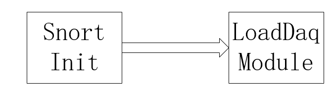
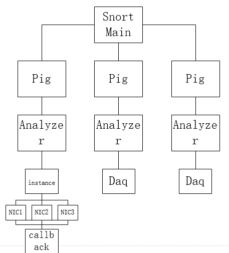

---
## DAQ 与Snort
在snort-daq中，daq的控制流程是这样的。  
  
如上所述，Snort在初始化的时候载入了daq。这个时候snort的所调用的api是`daq_load_modules`。也就是说，这个时候在主线程没有启动网卡，初始化实例的操作。  
在初始化整个snort之后（载入配置，载入daq及其他各个模块等等）。snort就进入了分析的阶段了。这个阶段的主角是
`pig`，或者说更本质的，是`pig`下的`analyzer`。
Snort下面开n个`pig`线程。`pig`线程下面调用`analyzer`来进行包解析。  
包解析的过程中是在`pig`线程中多线程并行进行的。每一个`analyzer`下面都初始化一个`daq instance`并调用`acquire`进行抓包并分析。每一个`daq instance`下面都有一个或多个网卡来获取数据。因为目的主要是介绍daq，所以怎么解析就不提了。  
  
从上图和上面的介绍就可以看得出来，一个snort下面有多个`daq instance`并行运行。每一个`daq instance`都会进行初始化操作，占用系统资源，获取网卡，抓包，调用`callback`，之间相互独立。并且是**单线程**的。

---
## DAQ与DPDK
如上面所介绍的。DAQ在设计的时候是单线程的。在本身的实现的几个模块中（Netmap,pcap等等）完全没有涉及到多线程的事情。在snort中的调用也是单线程并行调用的，相互之间各不影响。而Inter的DPDK在多线程方面则有限制。它所初始化的`EAL`层只能初始化一次。一个程序中只能运行一个dpdk主程序。所以就没有办法在snort中使用多线程。因为如果在snort中使用了多线程。那么实际上每个线程都会去尝试初始化dpdk的`EAL`。那么就会出错，导致最后只有一个线程能够成功初始化并启动。  
所以如果要想实现一个支持snort多线程的daq。就需要修改daq中api的逻辑。
在实现中，利用线程id来绑定网卡。
在daq的content中加入了一个`nic`-`threadid`的映射表。然后每个网卡都有一个独立的`instance`存储原本在`daq_content`中的信息。然后在线程调用daq相关函数的时候，都会先利用threadid来进行检索这个`instance`进行操作。通过这个方法就能够将dpdk中的各个网卡独立运行。

---
## Github地址
[daq_dpdk](https://github.com/NachtZ/daq_dpdk)  
基于的是`dpdk16.04`, `daq2.1.0`,`snort 3.0 a04`.
使用方法在项目主页中。
